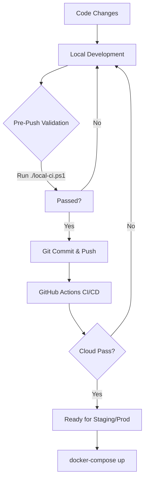

# Devcourses Full-Stack Development Workflow

This document explains the "Chain of Command" for developing, testing, and deploying the Devcourses project. Following this flow ensures that your code is always stable and ready for production.

---

## 1. Visual Overview (The CI/CD Chain)



---

## 2. Phase 1: Local Development & Verification

Before you push any code to GitHub, you should follow this sequence of commands to ensure high quality.

| Step | Command | Purpose (The "Why") | When to use it? |
| :--- | :--- | :--- | :--- |
| **1. Validate** | `./local-ci.ps1` | **Absolute Verification**. Runs Backend tests, Frontend tests, and validates Docker from scratch. | **Mandatory** before every `git push`. |
| **2. Build** | `docker compose build` | Ensures the Docker images can still be created after your changes. | After changing `Dockerfile` or `pom.xml`/`package.json`. |
| **3. Deploy** | `docker compose up -d` | Starts the entire full-stack environment locally. | When you want to see the app running integrated with the DB. |

---

## 3. Phase 2: The Git Flow (Uploading Changes)

We use a "Mainline" strategy. This means `main` is our source of truth.

### Standard Git Sequence:

1.  **Stage your changes**:
    ```bash
    git add .
    ```
2.  **Commit with a clear message**:
    ```bash
    git commit -m "feat: added login authentication flow"
    ```
3.  **Push to GitHub**:
    ```bash
    git push origin main
    ```

---

## 4. Phase 3: Cloud CI/CD (GitHub Actions)

Once you run `git push`, GitHub takes over. It executes the instructions in [.github/workflows/main.yml](.github/workflows/main.yml).

- **Backend CI**: Spins up a real PostgreSQL service, runs Maven tests, and creates a JAR.
- **Frontend CI**: Installs dependencies (with `--legacy-peer-deps`), runs Vitest, and creates the Angular build.
- **Docker Validation**: Runs `docker compose build` on the GitHub servers to ensure the project is "Deployable".

---

## 5. Summary Table: Command Purpose

| Component | Command | Purpose |
| :--- | :--- | :--- |
| **Backend** | `./mvnw clean test` | Runs Java Logic/JUnit tests. |
| **Frontend** | `npm test` | Runs Angular/Vitest component tests. |
| **Full-Stack** | `./local-ci.ps1` | Orchestrates ALL tests sequentially. |
| **Infrastructure** | `docker-compose down -v` | Resets everything (including database volumes). |

---

> [!TIP]
> **Always run `./local-ci.ps1`**. This is your safety net. If this passes locally, your GitHub Actions pipeline will almost certainly pass too.

> [!IMPORTANT]
> **GitHub Secrets**: Remember that production secrets are NOT in the code. They are managed in the GitHub Repo settings under **Secrets and Variables > Actions**.
