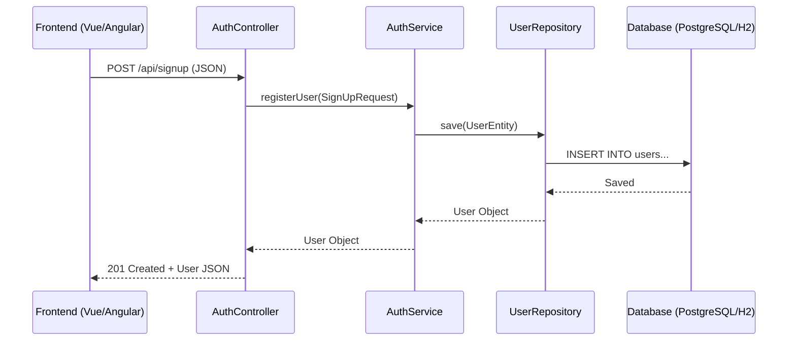

# Backend Project Flow Documentation - Devcourses

This document provides a complete and detailed overview of the backend architecture, security flow, and component interactions for the **Devcourses** Spring Boot application.

---

## 1. Project Overview

- **Framework**: Spring Boot 3.5.8
- **Language**: Java 25
- **Build Tool**: Maven
- **Database**: PostgreSQL (Production) / H2 (Development)
- **Security**: Spring Security with Stateless JWT Authentication

---

## 2. Directory Structure & Layers

The project follows a standard N-tier architecture:

- **`config`**: Infrastructure and general configuration.
- **`controller`**: REST API endpoints (Entry point for frontend).
- **`service`**: Business logic layer (Orchestrates repositories and utilities).
- **`model`**: Persistent JPA entities (Database representation).
- **`repository`**: Data access layer (Interfaces extending JpaRepository).
- **`security`**: Authentication, authorization, and JWT filters.
- **`dto`**: Data Transfer Objects (Requests and Responses).

---

## 3. Detailed Security Flow

### A. Authentication (Registration & Login)

1.  **Registration (`/api/signup`)**:
    - Frontend sends `SignUpRequest` (Name, Email, Password).
    - `AuthController` receives the request.
    - `AuthService` hashes the password using `BCryptPasswordEncoder`.
    - A new `User` is saved to the database via `UserRepository`.

2.  **Login (`/api/signin`)**:
    - Frontend sends `LoginRequest` (Email, Password).
    - `AuthController` calls `AuthService.authenticateUser()`.
    - `AuthenticationManager` (delegated to `DaoAuthenticationProvider`) verifies credentials against `CustomUserDetailsService`.
    - If successful, `JwtTokenProvider` generates a signed JWT.
    - Backend returns a `JwtAuthenticationResponse` containing the `accessToken`.

### B. Authorization (Subsequent Requests)

For every protected request (e.g., `/api/any-protected-endpoint`):

1.  **Intercept**: `JwtAuthenticationFilter` intercepts the request before it reaches the controller.
2.  **Extract**: It looks for the `Authorization: Bearer <token>` header.
3.  **Validate**: `JwtTokenProvider` parses and validates the token's signature, expiration, and issuer.
4.  **Set Context**: If valid, the user's identity is stored in Spring's `SecurityContextHolder`.
5.  **Proceed**: The request continues to the controller as an "Authenticated" request.

---

## 4. Component Interaction Diagram (MVC)

---

## 5. Security Configuration (`SecurityConfig.java`)

Key settings implemented:

- **Stateless Session**: No server-side sessions; the token is the only source of truth.
- **CORS**: Configured to allow requests from `http://localhost:4200` (Angular) and `http://localhost:5173` (Vue/Vite).
- **Permitted Endpoints**:
  - `/api/signin`, `/api/signup` (Anonymous access).
  - `/api/health` (Service monitoring).
  - `/api/users/**` (Permitted for testing/admin purposes).
- **CSRF**: Disabled (safe for stateless JWT).

---

## 6. Functional Endpoints

| Method     | Endpoint          | Description                         | Access                |
| :--------- | :---------------- | :---------------------------------- | :-------------------- |
| **POST**   | `/api/signup`     | Registers a new user.               | Public                |
| **POST**   | `/api/signin`     | Authenticates user and returns JWT. | Public                |
| **GET**    | `/api/users`      | Lists all registered users.         | Public (Configurable) |
| **PUT**    | `/api/users/{id}` | Updates user information.           | Public (Configurable) |
| **DELETE** | `/api/users/{id}` | Removes a user.                     | Public (Configurable) |
| **GET**    | `/api/health`     | Simple server health check.         | Public                |

---

## 7. Data Layer

- **Entity**: `User.java` (defines `@Id`, `@Table`, `@Column`).
- **Repository**: `UserRepository.java` (provides `findByEmail`, `existsByEmail`).
- **Initialization**: `DataInitializer.java` handles pre-loading data for development.
